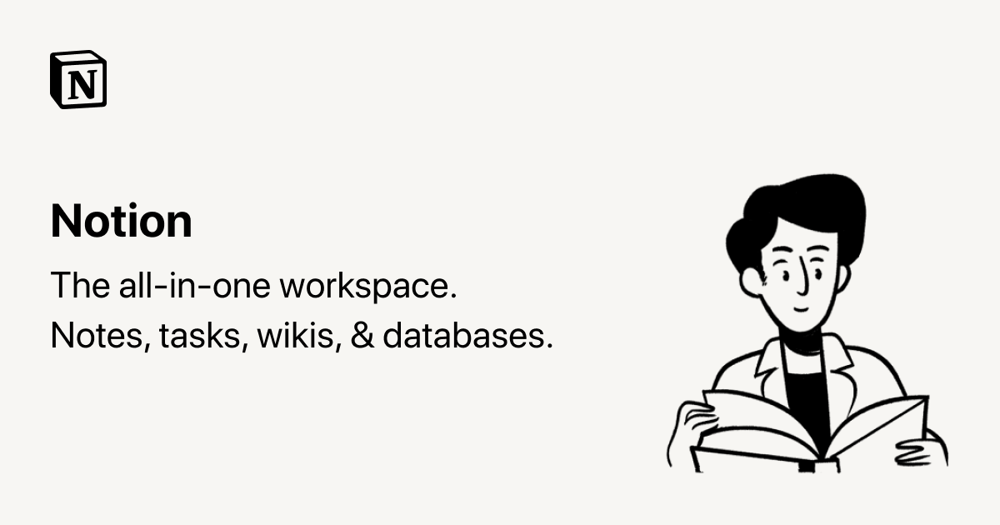

<div align="left">

[](https://developers.notion.com)

# Notion<a id="notion"></a>

Notion is a new tool that blends your everyday work apps into one. It's the all-in-one workspace for you and your team.


</div>

## Table of Contents<a id="table-of-contents"></a>

<!-- toc -->

- [Requirements](#requirements)
- [Installation](#installation)
- [Getting Started](#getting-started)
- [Async](#async)
- [Raw HTTP Response](#raw-http-response)
- [Reference](#reference)
  * [`notion.block.append_children`](#notionblockappend_children)
  * [`notion.block.get_children`](#notionblockget_children)
  * [`notion.block.get_details`](#notionblockget_details)
  * [`notion.block.remove_block_by_id`](#notionblockremove_block_by_id)
  * [`notion.block.update_block_by_id`](#notionblockupdate_block_by_id)
  * [`notion.comment.create_new`](#notioncommentcreate_new)
  * [`notion.comment.get_list`](#notioncommentget_list)
  * [`notion.database.create_new_database`](#notiondatabasecreate_new_database)
  * [`notion.database.execute_query`](#notiondatabaseexecute_query)
  * [`notion.database.get_database`](#notiondatabaseget_database)
  * [`notion.database.update_database`](#notiondatabaseupdate_database)
  * [`notion.page.create_new_page`](#notionpagecreate_new_page)
  * [`notion.page.get_page`](#notionpageget_page)
  * [`notion.page.get_property_item`](#notionpageget_property_item)
  * [`notion.page.update_properties`](#notionpageupdate_properties)
  * [`notion.search.by_title`](#notionsearchby_title)
  * [`notion.token.generate_access`](#notiontokengenerate_access)
  * [`notion.user.get_token_bot_user`](#notionuserget_token_bot_user)
  * [`notion.user.get_user_by_id`](#notionuserget_user_by_id)
  * [`notion.user.list_all_users`](#notionuserlist_all_users)

<!-- tocstop -->

## Requirements<a id="requirements"></a>

Python >=3.7

## Installation<a id="installation"></a>
<div align="center">
  <a href="https://konfigthis.com/sdk-sign-up?company=Notion&language=Python">
    
  </a>
</div>

## Getting Started<a id="getting-started"></a>

```python
from pprint import pprint
from notion_python_sdk import Notion, ApiException

notion = Notion()

try:
    # Append block children
    append_children_response = notion.block.append_children(
        children=[None],
        block_id="block_id_example",
        notion_version="2022-06-28",
        after="string_example",
    )
    print(append_children_response)
except ApiException as e:
    print("Exception when calling BlockApi.append_children: %s\n" % e)
    pprint(e.body)
    pprint(e.headers)
    pprint(e.status)
    pprint(e.reason)
    pprint(e.round_trip_time)
```

## Async<a id="async"></a>

`async` support is available by prepending `a` to any method.

```python
import asyncio
from pprint import pprint
from notion_python_sdk import Notion, ApiException

notion = Notion()


async def main():
    try:
        # Append block children
        append_children_response = await notion.block.aappend_children(
            children=[None],
            block_id="block_id_example",
            notion_version="2022-06-28",
            after="string_example",
        )
        print(append_children_response)
    except ApiException as e:
        print("Exception when calling BlockApi.append_children: %s\n" % e)
        pprint(e.body)
        pprint(e.headers)
        pprint(e.status)
        pprint(e.reason)
        pprint(e.round_trip_time)


asyncio.run(main())
```

## Raw HTTP Response<a id="raw-http-response"></a>

To access raw HTTP response values, use the `.raw` namespace.

```python
from pprint import pprint
from notion_python_sdk import Notion, ApiException

notion = Notion()

try:
    # Append block children
    append_children_response = notion.block.raw.append_children(
        children=[None],
        block_id="block_id_example",
        notion_version="2022-06-28",
        after="string_example",
    )
    pprint(append_children_response.body)
    pprint(append_children_response.body["object"])
    pprint(append_children_response.body["results"])
    pprint(append_children_response.body["next_cursor"])
    pprint(append_children_response.body["has_more"])
    pprint(append_children_response.body["type"])
    pprint(append_children_response.body["block"])
    pprint(append_children_response.headers)
    pprint(append_children_response.status)
    pprint(append_children_response.round_trip_time)
except ApiException as e:
    print("Exception when calling BlockApi.append_children: %s\n" % e)
    pprint(e.body)
    pprint(e.headers)
    pprint(e.status)
    pprint(e.reason)
    pprint(e.round_trip_time)
```


## Reference<a id="reference"></a>
### `notion.block.append_children`<a id="notionblockappend_children"></a>

Append block children

#### 🛠️ Usage<a id="🛠️-usage"></a>

```python
append_children_response = notion.block.append_children(
    children=[None],
    block_id="block_id_example",
    notion_version="2022-06-28",
    after="string_example",
)
```

#### ⚙️ Parameters<a id="⚙️-parameters"></a>

##### children: [`BlockAppendChildrenRequestChildren`](./notion_python_sdk/type/block_append_children_request_children.py)<a id="children-blockappendchildrenrequestchildrennotion_python_sdktypeblock_append_children_request_childrenpy"></a>

##### block_id: `str`<a id="block_id-str"></a>

Identifier for a [block](ref:block). Also accepts a [page](ref:page) ID.

##### notion_version: `str`<a id="notion_version-str"></a>

##### after: `str`<a id="after-str"></a>

The ID of the existing block that the new block should be appended after.

#### ⚙️ Request Body<a id="⚙️-request-body"></a>

[`BlockAppendChildrenRequest`](./notion_python_sdk/type/block_append_children_request.py)
#### 🔄 Return<a id="🔄-return"></a>

[`BlockAppendChildrenResponse`](./notion_python_sdk/pydantic/block_append_children_response.py)

#### 🌐 Endpoint<a id="🌐-endpoint"></a>

`/v1/blocks/{block_id}/children` `patch`

[🔙 **Back to Table of Contents**](#table-of-contents)

---

### `notion.block.get_children`<a id="notionblockget_children"></a>

Retrieve block children

#### 🛠️ Usage<a id="🛠️-usage"></a>

```python
get_children_response = notion.block.get_children(
    block_id="block_id_example",
    notion_version="2022-06-28",
    start_cursor="string_example",
    page_size=100,
)
```

#### ⚙️ Parameters<a id="⚙️-parameters"></a>

##### block_id: `str`<a id="block_id-str"></a>

Identifier for a [block](ref:block)

##### notion_version: `str`<a id="notion_version-str"></a>

##### start_cursor: `str`<a id="start_cursor-str"></a>

If supplied, this endpoint will return a page of results starting after the cursor provided. If not supplied, this endpoint will return the first page of results.

##### page_size: `int`<a id="page_size-int"></a>

The number of items from the full list desired in the response. Maximum: 100

#### 🔄 Return<a id="🔄-return"></a>

[`BlockGetChildrenResponse`](./notion_python_sdk/pydantic/block_get_children_response.py)

#### 🌐 Endpoint<a id="🌐-endpoint"></a>

`/v1/blocks/{block_id}/children` `get`

[🔙 **Back to Table of Contents**](#table-of-contents)

---

### `notion.block.get_details`<a id="notionblockget_details"></a>

Retrieve a block

#### 🛠️ Usage<a id="🛠️-usage"></a>

```python
get_details_response = notion.block.get_details(
    block_id="block_id_example",
    notion_version="2022-06-28",
)
```

#### ⚙️ Parameters<a id="⚙️-parameters"></a>

##### block_id: `str`<a id="block_id-str"></a>

Identifier for a Notion block

##### notion_version: `str`<a id="notion_version-str"></a>

#### 🔄 Return<a id="🔄-return"></a>

[`BlockGetDetailsResponse`](./notion_python_sdk/pydantic/block_get_details_response.py)

#### 🌐 Endpoint<a id="🌐-endpoint"></a>

`/v1/blocks/{block_id}` `get`

[🔙 **Back to Table of Contents**](#table-of-contents)

---

### `notion.block.remove_block_by_id`<a id="notionblockremove_block_by_id"></a>

Delete a block

#### 🛠️ Usage<a id="🛠️-usage"></a>

```python
remove_block_by_id_response = notion.block.remove_block_by_id(
    block_id="block_id_example",
    notion_version="2022-06-28",
)
```

#### ⚙️ Parameters<a id="⚙️-parameters"></a>

##### block_id: `str`<a id="block_id-str"></a>

Identifier for a Notion block

##### notion_version: `str`<a id="notion_version-str"></a>

#### 🔄 Return<a id="🔄-return"></a>

[`BlockRemoveBlockByIdResponse`](./notion_python_sdk/pydantic/block_remove_block_by_id_response.py)

#### 🌐 Endpoint<a id="🌐-endpoint"></a>

`/v1/blocks/{block_id}` `delete`

[🔙 **Back to Table of Contents**](#table-of-contents)

---

### `notion.block.update_block_by_id`<a id="notionblockupdate_block_by_id"></a>

Update a block

#### 🛠️ Usage<a id="🛠️-usage"></a>

```python
update_block_by_id_response = notion.block.update_block_by_id(
    block_id="block_id_example",
    type={},
    archived=True,
    notion_version="2022-06-28",
)
```

#### ⚙️ Parameters<a id="⚙️-parameters"></a>

##### block_id: `str`<a id="block_id-str"></a>

Identifier for a Notion block

##### type: `Dict[str, Union[bool, date, datetime, dict, float, int, list, str, None]]`<a id="type-dictstr-unionbool-date-datetime-dict-float-int-list-str-none"></a>

The [block object `type`](ref:block#block-object-keys) value with the properties to be updated. Currently only `text` (for supported block types) and `checked` (for `to_do` blocks) fields can be updated.

##### archived: `bool`<a id="archived-bool"></a>

Set to true to archive (delete) a block. Set to false to un-archive (restore) a block.

##### notion_version: `str`<a id="notion_version-str"></a>

#### ⚙️ Request Body<a id="⚙️-request-body"></a>

[`BlockUpdateBlockByIdRequest`](./notion_python_sdk/type/block_update_block_by_id_request.py)
#### 🔄 Return<a id="🔄-return"></a>

[`BlockUpdateBlockByIdResponse`](./notion_python_sdk/pydantic/block_update_block_by_id_response.py)

#### 🌐 Endpoint<a id="🌐-endpoint"></a>

`/v1/blocks/{block_id}` `patch`

[🔙 **Back to Table of Contents**](#table-of-contents)

---

### `notion.comment.create_new`<a id="notioncommentcreate_new"></a>

Creates a comment in a page or existing discussion thread.

#### 🛠️ Usage<a id="🛠️-usage"></a>

```python
create_new_response = notion.comment.create_new(
    rich_text="string_example",
    notion_version="2022-06-28",
    parent="string_example",
    discussion_id="string_example",
)
```

#### ⚙️ Parameters<a id="⚙️-parameters"></a>

##### rich_text: `str`<a id="rich_text-str"></a>

A [rich text object](ref:rich-text)

##### notion_version: `str`<a id="notion_version-str"></a>

##### parent: `str`<a id="parent-str"></a>

A [page parent](/reference/database#page-parent). Either this or a discussion_id is required (not both)

##### discussion_id: `str`<a id="discussion_id-str"></a>

A UUID identifier for a discussion thread. Either this or a parent object is required (not both)

#### ⚙️ Request Body<a id="⚙️-request-body"></a>

[`CommentCreateNewRequest`](./notion_python_sdk/type/comment_create_new_request.py)
#### 🔄 Return<a id="🔄-return"></a>

[`CommentCreateNewResponse`](./notion_python_sdk/pydantic/comment_create_new_response.py)

#### 🌐 Endpoint<a id="🌐-endpoint"></a>

`/v1/comments` `post`

[🔙 **Back to Table of Contents**](#table-of-contents)

---

### `notion.comment.get_list`<a id="notioncommentget_list"></a>

Retrieves a list of un-resolved [Comment objects](ref:comment-object) from a page or block.

#### 🛠️ Usage<a id="🛠️-usage"></a>

```python
get_list_response = notion.comment.get_list(
    notion_version="2022-06-28",
    block_id="block_id_example",
    start_cursor="string_example",
    page_size=1,
)
```

#### ⚙️ Parameters<a id="⚙️-parameters"></a>

##### notion_version: `str`<a id="notion_version-str"></a>

##### block_id: `str`<a id="block_id-str"></a>

Identifier for a Notion block or page

##### start_cursor: `str`<a id="start_cursor-str"></a>

If supplied, this endpoint will return a page of results starting after the cursor provided. If not supplied, this endpoint will return the first page of results.

##### page_size: `int`<a id="page_size-int"></a>

The number of items from the full list desired in the response. Maximum: 100

#### 🔄 Return<a id="🔄-return"></a>

[`CommentGetListResponse`](./notion_python_sdk/pydantic/comment_get_list_response.py)

#### 🌐 Endpoint<a id="🌐-endpoint"></a>

`/v1/comments` `get`

[🔙 **Back to Table of Contents**](#table-of-contents)

---

### `notion.database.create_new_database`<a id="notiondatabasecreate_new_database"></a>

Create a database

#### 🛠️ Usage<a id="🛠️-usage"></a>

```python
create_new_database_response = notion.database.create_new_database(
    parent="string_example",
    properties="string_example",
    notion_version="2022-06-28",
    title=[None],
)
```

#### ⚙️ Parameters<a id="⚙️-parameters"></a>

##### parent: `str`<a id="parent-str"></a>

A [page parent](/reference/database#page-parent)

##### properties: `str`<a id="properties-str"></a>

Property schema of database. The keys are the names of properties as they appear in Notion and the values are [property schema objects](https://developers.notion.com/reference/property-schema-object).

##### notion_version: `str`<a id="notion_version-str"></a>

##### title: [`DatabaseCreateNewDatabaseRequestTitle`](./notion_python_sdk/type/database_create_new_database_request_title.py)<a id="title-databasecreatenewdatabaserequesttitlenotion_python_sdktypedatabase_create_new_database_request_titlepy"></a>

#### ⚙️ Request Body<a id="⚙️-request-body"></a>

[`DatabaseCreateNewDatabaseRequest`](./notion_python_sdk/type/database_create_new_database_request.py)
#### 🌐 Endpoint<a id="🌐-endpoint"></a>

`/v1/databases` `post`

[🔙 **Back to Table of Contents**](#table-of-contents)

---

### `notion.database.execute_query`<a id="notiondatabaseexecute_query"></a>

Query a database

#### 🛠️ Usage<a id="🛠️-usage"></a>

```python
execute_query_response = notion.database.execute_query(
    database_id="database_id_example",
    notion_version="2022-06-28",
    filter="string_example",
    sorts=[None],
    start_cursor="string_example",
    page_size=100,
    filter_properties="string_example",
)
```

#### ⚙️ Parameters<a id="⚙️-parameters"></a>

##### database_id: `str`<a id="database_id-str"></a>

Identifier for a Notion database.

##### notion_version: `str`<a id="notion_version-str"></a>

##### filter: `str`<a id="filter-str"></a>

When supplied, limits which pages are returned based on the [filter conditions](ref:post-database-query-filter).

##### sorts: [`DatabaseExecuteQueryRequestSorts`](./notion_python_sdk/type/database_execute_query_request_sorts.py)<a id="sorts-databaseexecutequeryrequestsortsnotion_python_sdktypedatabase_execute_query_request_sortspy"></a>

##### start_cursor: `str`<a id="start_cursor-str"></a>

When supplied, returns a page of results starting after the cursor provided. If not supplied, this endpoint will return the first page of results.

##### page_size: `int`<a id="page_size-int"></a>

The number of items from the full list desired in the response. Maximum: 100

##### filter_properties: `str`<a id="filter_properties-str"></a>

A list of page property value IDs associated with the database. Use this param to limit the response to a specific page property value or values for pages that meet the `filter` criteria.

#### ⚙️ Request Body<a id="⚙️-request-body"></a>

[`DatabaseExecuteQueryRequest`](./notion_python_sdk/type/database_execute_query_request.py)
#### 🔄 Return<a id="🔄-return"></a>

[`DatabaseExecuteQueryResponse`](./notion_python_sdk/pydantic/database_execute_query_response.py)

#### 🌐 Endpoint<a id="🌐-endpoint"></a>

`/v1/databases/{database_id}/query` `post`

[🔙 **Back to Table of Contents**](#table-of-contents)

---

### `notion.database.get_database`<a id="notiondatabaseget_database"></a>

Retrieve a database

#### 🛠️ Usage<a id="🛠️-usage"></a>

```python
get_database_response = notion.database.get_database(
    database_id="database_id_example",
    notion_version="2022-06-28",
)
```

#### ⚙️ Parameters<a id="⚙️-parameters"></a>

##### database_id: `str`<a id="database_id-str"></a>

An identifier for the Notion database.

##### notion_version: `str`<a id="notion_version-str"></a>

#### 🔄 Return<a id="🔄-return"></a>

[`DatabaseGetDatabaseResponse`](./notion_python_sdk/pydantic/database_get_database_response.py)

#### 🌐 Endpoint<a id="🌐-endpoint"></a>

`/v1/databases/{database_id}` `get`

[🔙 **Back to Table of Contents**](#table-of-contents)

---

### `notion.database.update_database`<a id="notiondatabaseupdate_database"></a>

Update a database

#### 🛠️ Usage<a id="🛠️-usage"></a>

```python
update_database_response = notion.database.update_database(
    database_id="database_id_example",
    title=[None],
    description=[None],
    properties="string_example",
    notion_version="2022-06-28",
)
```

#### ⚙️ Parameters<a id="⚙️-parameters"></a>

##### database_id: `str`<a id="database_id-str"></a>

identifier for a Notion database

##### title: [`DatabaseUpdateDatabaseRequestTitle`](./notion_python_sdk/type/database_update_database_request_title.py)<a id="title-databaseupdatedatabaserequesttitlenotion_python_sdktypedatabase_update_database_request_titlepy"></a>

##### description: [`DatabaseUpdateDatabaseRequestDescription`](./notion_python_sdk/type/database_update_database_request_description.py)<a id="description-databaseupdatedatabaserequestdescriptionnotion_python_sdktypedatabase_update_database_request_descriptionpy"></a>

##### properties: `str`<a id="properties-str"></a>

The properties of a database to be changed in the request, in the form of a JSON object. If updating an existing property, then the keys are the names or IDs of the properties as they appear in Notion, and the values are [property schema objects](ref:property-schema-object). If adding a new property, then the key is the name of the new database property and the value is a [property schema object](ref:property-schema-object).

##### notion_version: `str`<a id="notion_version-str"></a>

#### ⚙️ Request Body<a id="⚙️-request-body"></a>

[`DatabaseUpdateDatabaseRequest`](./notion_python_sdk/type/database_update_database_request.py)
#### 🌐 Endpoint<a id="🌐-endpoint"></a>

`/v1/databases/{database_id}` `patch`

[🔙 **Back to Table of Contents**](#table-of-contents)

---

### `notion.page.create_new_page`<a id="notionpagecreate_new_page"></a>

Create a page

#### 🛠️ Usage<a id="🛠️-usage"></a>

```python
create_new_page_response = notion.page.create_new_page(
    parent="string_example",
    properties="string_example",
    notion_version="2022-06-28",
    children=["string_example"],
    icon="string_example",
    cover="string_example",
)
```

#### ⚙️ Parameters<a id="⚙️-parameters"></a>

##### parent: `str`<a id="parent-str"></a>

The parent page or database where the new page is inserted, represented as a JSON object with a `page_id` or `database_id` key, and the corresponding ID.

##### properties: `str`<a id="properties-str"></a>

The values of the page’s properties. If the `parent` is a database, then the schema must match the parent database’s properties. If the `parent` is a page, then the only valid object key is `title`.

##### notion_version: `str`<a id="notion_version-str"></a>

##### children: [`PageCreateNewPageRequestChildren`](./notion_python_sdk/type/page_create_new_page_request_children.py)<a id="children-pagecreatenewpagerequestchildrennotion_python_sdktypepage_create_new_page_request_childrenpy"></a>

##### icon: `str`<a id="icon-str"></a>

The icon of the new page. Either an [emoji object](https://developers.notion.com/reference/emoji-object) or an [external file object](https://developers.notion.com/reference/file-object)..

##### cover: `str`<a id="cover-str"></a>

The cover image of the new page, represented as a [file object](https://developers.notion.com/reference/file-object).

#### ⚙️ Request Body<a id="⚙️-request-body"></a>

[`PageCreateNewPageRequest`](./notion_python_sdk/type/page_create_new_page_request.py)
#### 🔄 Return<a id="🔄-return"></a>

[`PageCreateNewPageResponse`](./notion_python_sdk/pydantic/page_create_new_page_response.py)

#### 🌐 Endpoint<a id="🌐-endpoint"></a>

`/v1/pages` `post`

[🔙 **Back to Table of Contents**](#table-of-contents)

---

### `notion.page.get_page`<a id="notionpageget_page"></a>

Retrieve a page

#### 🛠️ Usage<a id="🛠️-usage"></a>

```python
get_page_response = notion.page.get_page(
    page_id="page_id_example",
    notion_version="2022-06-28",
    filter_properties="string_example",
)
```

#### ⚙️ Parameters<a id="⚙️-parameters"></a>

##### page_id: `str`<a id="page_id-str"></a>

Identifier for a Notion page

##### notion_version: `str`<a id="notion_version-str"></a>

##### filter_properties: `str`<a id="filter_properties-str"></a>

A list of page property value IDs associated with the page. Use this param to limit the response to a specific page property value or values. To retrieve multiple properties, specify each page property ID. For example: `?filter_properties=iAk8&filter_properties=b7dh`.

#### 🔄 Return<a id="🔄-return"></a>

[`PageGetPageResponse`](./notion_python_sdk/pydantic/page_get_page_response.py)

#### 🌐 Endpoint<a id="🌐-endpoint"></a>

`/v1/pages/{page_id}` `get`

[🔙 **Back to Table of Contents**](#table-of-contents)

---

### `notion.page.get_property_item`<a id="notionpageget_property_item"></a>

Retrieve a page property item

#### 🛠️ Usage<a id="🛠️-usage"></a>

```python
get_property_item_response = notion.page.get_property_item(
    page_id="page_id_example",
    property_id="property_id_example",
    page_size=1,
    start_cursor="string_example",
    notion_version="2022-06-28",
)
```

#### ⚙️ Parameters<a id="⚙️-parameters"></a>

##### page_id: `str`<a id="page_id-str"></a>

Identifier for a Notion page

##### property_id: `str`<a id="property_id-str"></a>

Identifier for a page [property](https://developers.notion.com/reference/page#all-property-values)

##### page_size: `int`<a id="page_size-int"></a>

For paginated properties. The max number of property item objects on a page. The default size is 100

##### start_cursor: `str`<a id="start_cursor-str"></a>

For paginated properties.

##### notion_version: `str`<a id="notion_version-str"></a>

#### 🌐 Endpoint<a id="🌐-endpoint"></a>

`/v1/pages/{page_id}/properties/{property_id}` `get`

[🔙 **Back to Table of Contents**](#table-of-contents)

---

### `notion.page.update_properties`<a id="notionpageupdate_properties"></a>

Update page properties

#### 🛠️ Usage<a id="🛠️-usage"></a>

```python
update_properties_response = notion.page.update_properties(
    page_id="page_id_example",
    properties="string_example",
    archived=True,
    icon="string_example",
    cover="string_example",
    notion_version="2022-06-28",
)
```

#### ⚙️ Parameters<a id="⚙️-parameters"></a>

##### page_id: `str`<a id="page_id-str"></a>

The identifier for the Notion page to be updated.

##### properties: `str`<a id="properties-str"></a>

The property values to update for the page. The keys are the names or IDs of the property and the values are property values. If a page property ID is not included, then it is not changed.

##### archived: `bool`<a id="archived-bool"></a>

Whether the page is archived (deleted). Set to true to archive a page. Set to false to un-archive (restore) a page.

##### icon: `str`<a id="icon-str"></a>

A page icon for the page. Supported types are [external file object](https://developers.notion.com/reference/file-object) or [emoji object](https://developers.notion.com/reference/emoji-object).

##### cover: `str`<a id="cover-str"></a>

A cover image for the page. Only [external file objects](https://developers.notion.com/reference/file-object) are supported.

##### notion_version: `str`<a id="notion_version-str"></a>

#### ⚙️ Request Body<a id="⚙️-request-body"></a>

[`PageUpdatePropertiesRequest`](./notion_python_sdk/type/page_update_properties_request.py)
#### 🔄 Return<a id="🔄-return"></a>

[`PageUpdatePropertiesResponse`](./notion_python_sdk/pydantic/page_update_properties_response.py)

#### 🌐 Endpoint<a id="🌐-endpoint"></a>

`/v1/pages/{page_id}` `patch`

[🔙 **Back to Table of Contents**](#table-of-contents)

---

### `notion.search.by_title`<a id="notionsearchby_title"></a>

Search by title

#### 🛠️ Usage<a id="🛠️-usage"></a>

```python
by_title_response = notion.search.by_title(
    notion_version="2022-06-28",
    query="string_example",
    sort={},
    filter={},
    start_cursor="string_example",
    page_size=100,
)
```

#### ⚙️ Parameters<a id="⚙️-parameters"></a>

##### notion_version: `str`<a id="notion_version-str"></a>

##### query: `str`<a id="query-str"></a>

The text that the API compares page and database titles against.

##### sort: [`SearchByTitleRequestSort`](./notion_python_sdk/type/search_by_title_request_sort.py)<a id="sort-searchbytitlerequestsortnotion_python_sdktypesearch_by_title_request_sortpy"></a>


##### filter: [`SearchByTitleRequestFilter`](./notion_python_sdk/type/search_by_title_request_filter.py)<a id="filter-searchbytitlerequestfilternotion_python_sdktypesearch_by_title_request_filterpy"></a>


##### start_cursor: `str`<a id="start_cursor-str"></a>

A `cursor` value returned in a previous response that If supplied, limits the response to results starting after the `cursor`. If not supplied, then the first page of results is returned. Refer to [pagination](https://developers.notion.com/reference/intro#pagination) for more details.

##### page_size: `int`<a id="page_size-int"></a>

The number of items from the full list to include in the response. Maximum: `100`.

#### ⚙️ Request Body<a id="⚙️-request-body"></a>

[`SearchByTitleRequest`](./notion_python_sdk/type/search_by_title_request.py)
#### 🔄 Return<a id="🔄-return"></a>

[`SearchByTitleResponse`](./notion_python_sdk/pydantic/search_by_title_response.py)

#### 🌐 Endpoint<a id="🌐-endpoint"></a>

`/v1/search` `post`

[🔙 **Back to Table of Contents**](#table-of-contents)

---

### `notion.token.generate_access`<a id="notiontokengenerate_access"></a>

Creates an access token that a third-party service can use to authenticate with Notion.

#### 🛠️ Usage<a id="🛠️-usage"></a>

```python
generate_access_response = notion.token.generate_access(
    code="string_example",
    grant_type='"authorization_code"',
    redirect_uri="string_example",
    external_account={},
)
```

#### ⚙️ Parameters<a id="⚙️-parameters"></a>

##### code: `str`<a id="code-str"></a>

A unique random code that Notion generates to authenticate with your service, generated when a user initiates the OAuth flow.

##### grant_type: `str`<a id="grant_type-str"></a>

A constant string: \\\"authorization_code\\\".

##### redirect_uri: `str`<a id="redirect_uri-str"></a>

The `\\\"redirect_uri\\\"` that was provided in the OAuth Domain & URI section of the integration's Authorization settings. Do not include this field if a `\\\"redirect_uri\\\"` query param was not included in the Authorization URL provided to users. In most cases, this field is required.

##### external_account: `Dict[str, Union[bool, date, datetime, dict, float, int, list, str, None]]`<a id="external_account-dictstr-unionbool-date-datetime-dict-float-int-list-str-none"></a>

Required if and only when building [Link Preview](https://developers.notion.com/docs/link-previews) integrations (otherwise ignored). An object with `key` and `name` properties. `key` should be a unique identifier for the account. Notion uses the `key` to determine whether or not the user is re-connecting the same account. `name` should be some way for the user to know which account they used to authenticate with your service. If a user has authenticated Notion with your integration before and `key` is the same but `name` is different, then Notion updates the `name` associated with your integration.

#### ⚙️ Request Body<a id="⚙️-request-body"></a>

[`TokenGenerateAccessRequest`](./notion_python_sdk/type/token_generate_access_request.py)
#### 🔄 Return<a id="🔄-return"></a>

[`TokenGenerateAccessResponse`](./notion_python_sdk/pydantic/token_generate_access_response.py)

#### 🌐 Endpoint<a id="🌐-endpoint"></a>

`/v1/oauth/token` `post`

[🔙 **Back to Table of Contents**](#table-of-contents)

---

### `notion.user.get_token_bot_user`<a id="notionuserget_token_bot_user"></a>

Retrieve your token's bot user

#### 🛠️ Usage<a id="🛠️-usage"></a>

```python
get_token_bot_user_response = notion.user.get_token_bot_user(
    notion_version="2022-06-28",
)
```

#### ⚙️ Parameters<a id="⚙️-parameters"></a>

##### notion_version: `str`<a id="notion_version-str"></a>

#### 🔄 Return<a id="🔄-return"></a>

[`UserGetTokenBotUserResponse`](./notion_python_sdk/pydantic/user_get_token_bot_user_response.py)

#### 🌐 Endpoint<a id="🌐-endpoint"></a>

`/v1/users/me` `get`

[🔙 **Back to Table of Contents**](#table-of-contents)

---

### `notion.user.get_user_by_id`<a id="notionuserget_user_by_id"></a>

Retrieve a user

#### 🛠️ Usage<a id="🛠️-usage"></a>

```python
get_user_by_id_response = notion.user.get_user_by_id(
    user_id="user_id_example",
    notion_version="2022-06-28",
)
```

#### ⚙️ Parameters<a id="⚙️-parameters"></a>

##### user_id: `str`<a id="user_id-str"></a>

Identifier for a Notion user

##### notion_version: `str`<a id="notion_version-str"></a>

#### 🌐 Endpoint<a id="🌐-endpoint"></a>

`/v1/users/{user_id}` `get`

[🔙 **Back to Table of Contents**](#table-of-contents)

---

### `notion.user.list_all_users`<a id="notionuserlist_all_users"></a>

List all users

#### 🛠️ Usage<a id="🛠️-usage"></a>

```python
list_all_users_response = notion.user.list_all_users(
    notion_version="2022-06-28",
    start_cursor="string_example",
    page_size=100,
)
```

#### ⚙️ Parameters<a id="⚙️-parameters"></a>

##### notion_version: `str`<a id="notion_version-str"></a>

##### start_cursor: `str`<a id="start_cursor-str"></a>

If supplied, this endpoint will return a page of results starting after the cursor provided. If not supplied, this endpoint will return the first page of results.

##### page_size: `int`<a id="page_size-int"></a>

The number of items from the full list desired in the response. Maximum: 100

#### 🌐 Endpoint<a id="🌐-endpoint"></a>

`/v1/users` `get`

[🔙 **Back to Table of Contents**](#table-of-contents)

---


## Author<a id="author"></a>
This Python package is automatically generated by [Konfig](https://konfigthis.com)
